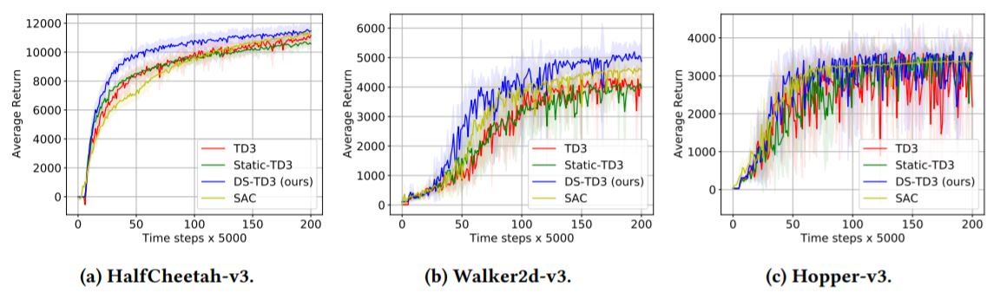

# Dynamic Sparse Training for Deep Reinforcement Learning

This is the Pytorch implementation for the IJCAI2022 [Dynamic Sparse Training for Deep Reinforcement Learning](https://arxiv.org/pdf/2106.04217.pdf) paper.

# Abstract
Deep reinforcement learning (DRL) agents are trained through trial-and-error interactions with the environment. This leads to a long training time for dense neural networks to achieve good performance. Hence, prohibitive computation and memory resources are consumed. Recently, learning efficient DRL agents has received increasing attention. Yet, current methods focus on accelerating inference time. In this paper, we introduce for the first time a dynamic sparse training approach for deep reinforcement learning to accelerate the training process. The proposed approach trains a sparse neural network from scratch and dynamically adapts its topology to the changing data distribution during training. Experiments on continuous control tasks show that our dynamic sparse agents achieve higher performance than the equivalent dense methods, reduce the parameter count and floating-point operations (FLOPs) by 50%, and have a faster learning speed that enables reaching the performance of dense agents with 40 − 50% reduction in the training steps

# Requirements
* Python 3.8
* PyTorch 1.5
* [Mujoco-py](https://github.com/openai/mujoco-py) 
* [OpenAI gym](https://github.com/openai/gym)

# Usage

For DS-TD3: Dynamic Sparse training of TD3 algorithm 
```
python main.py --env HalfCheetah-v3 --policy DS-TD3
```

For Static-TD3
```
python main.py --env HalfCheetah-v3 --policy StaticSparseTD3
```

For TD3
```
python main.py --env HalfCheetah-v3 --policy TD3
```

# Results

# Reference 

If you use this code, please cite our paper:
```
 @inproceedings{sokar2022dynamic,
  title={Dynamic Sparse Training for Deep Reinforcement Learning},
  author={Sokar, Ghada and Mocanu, Elena and Mocanu, Decebal Constantin and Pechenizkiy, Mykola and Stone, Peter},
  booktitle={International Joint Conference on Artificial Intelligence},
  year={2022}
}
```

# Acknowledgments
We start from the official code of the TD3 method from the following repository

[TD3](https://github.com/sfujim/TD3)
